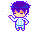
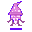
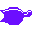
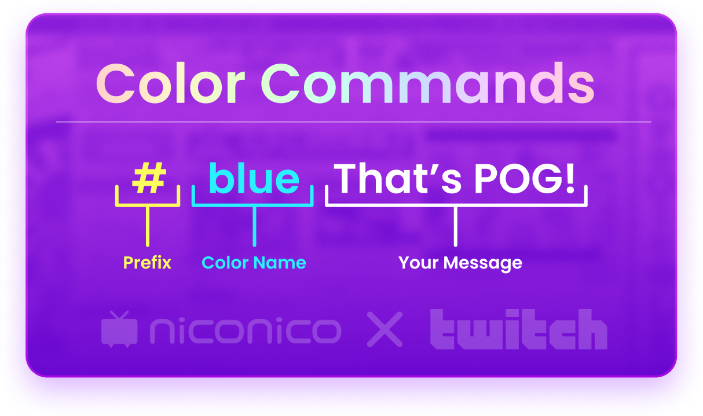
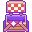
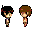

   

#  Niconico Twitch
[Niconico](https://www.nicovideo.jp/) Douga style chat overlay - Simply set it up.

"What kind of style are you referring to?" you might be asking. Well, here are some examples you might recognize!

### Niconico platform comments

### Osu! replay comments

#  Installation
## StreamElements
>  One-click installation is on its way, all we need is overlay sharing approval from StreamElements! 
1. On your StreamElements overlay (if you don't already have an overlay, create one on [StreamElements' overlay dashboard](https://streamelements.com/dashboard/overlays)), add a new custom widget by selecting "+" then `STATIC/CUSTOM` then `Custom widget`.
2. On your left side panel, select your widget → `Position, size and style` → Width and Height. Change your widget size to be the full resolution of your overlay. For example, if your overlay was 1080p, then your widget size should be 1920px by 1080px.
3. Center your widget by clicking on `CENTER WIDGET`.
4. On your widget, select `Settings` then `OPEN EDITOR`.
5. navigate to the StreamElements folder on our repository and paste each file content to the appropiate field on StreamElements. [`layout.html`](/StreamElements/layout.html) → `HTML`, [`chat.css`](/StreamElements/chat.css) → `CSS`, [`chat.js`](/StreamElements/chat.js) → `JS`, [`chat.json`](/StreamElements/chat.json) → `FIELDS`. Do not mess with the `DATA` field, it's just your current widget settings.

## Streamlabs - ⚠ WIP ⚠ - Not tested.
>  The Streamlabs version is still very much a prototype. It was not tested against things like XSS attacks and lacks a lot of features compared to the StreamElements version.
1. Navigate to the `Streamlabs` folder on our repository and copy each of the files.
2. Head into Streamlabs' [chatbox configuration dashboard](https://streamlabs.com/dashboard#/chatbox)
3. Navigate down to `Enable Custom HTML/CSS` and select `Enabled`.
4. Replace the code in each of the fields with the code from our repository.

#  Configuration
## StreamElements
Super straight-forward. Upon installing the widget correctly, new sections will appear on your left side panel with options to configure character limit, command hiding, bot and user chat hiding, and a ton of typography options as well.

## Configuration references | Settings

💬 Chat

| **Option** | **Default** | **Description** |
|:---|:---:|:---|
| **Message characters limit** | 250 | Limit of characters in a message, if exceeded, the message will not be shown on the overlay. You can override the max value of this field by modifying your the `max` value within `CharLimit` in your fields code. Do keep in mind that this will mess with the scrolling speed, modify your CSS keyframes to match your characters. Max characters in a Twitch chat message is 500 characters, this includes unformatted emotes. |
| **Users to hide messages from** | 25PStreamElements, Nightbot, Moobot, Cloudbot | The listed usernames you add here (separated by comma and space) will not be shown on the overlay. Great for bot messages. |
| **Hide command messages starting with (!)** | True | If a message represented a command by starting with the exclamation mark prefix, then it will not appear on the overlay.  |

🌈 Typography

| **Option** | **Default** | **Description** |
|:---|:---:|:---|
| **Font name** | Roboto | A [Google Fonts](https://fonts.google.com) font name or a locally installed font name. Changes the messages' font. |
| **Font size** | 7 | Font size relative to the height of the overlay. Can be changed to your favorite metric within your CSS file.   |
| **Message opacity** | 0.9 | The opacity of the appearing message, less makes the background more clear. `1` makes the text solid. |
| **Font weight** | Bold (700) | The thickness of your font. Options vary from font to font. |
| **Enable static color** | False | By default, the chat text's color is going to be the username the user sets in the chat appearance tab on Twitch. Enabling this will set the color of all chat messages to a single static color.  |
| **Static font color** |  rgba(255,255,255,1) | **`Enable static color` must be enabled for this option to work.** This will be the static color your chat messages will have. |
| **Let users choose their own message color by commands** | False | This option will let chat choose their own message color by adding a color prefix to their message. For example, `#red That's pretty pog!`. The `#red` part will be erased and the message will be colored according to the desired color. This can be a hex code, an RGB value or a color name from the [supported CSS color list](https://www.w3.org/wiki/CSS/Properties/color/keywords). |
| **Text shadow** | rgb(0, 0, 0) 1px 0px 0px | A CSS property to add shadow to your text. Can make texts seem more readable. |
| **Emote size** | 8 | Similar to font size. Relative to the overlay's view height as well. |

---
## Streamlabs

As the Streamlabs' current widget theme is experimental, configuration is unfortunately manual for the most part through code modification. [`chat.js`](/Streamlabs/chat.js) contains comments documenting what each line of code does. For beginners, we'll recommend you use [StreamElements](https://streamelements.com/) until the Streamlabs version is user-friendly to some extent <3

#  Bio Panel
Feel free to use this panel in your channel's bio to help your viewers understand how color commands work!

#  TODO
- [x] Support StreamElements 🦄
- [x] Built-in customization options
- [x] Secure against XSS attacks
- [x] Color commands 🌈
- [ ] Rich text formatting
- [ ] One-click installation
- [ ] Event options 
- [ ] Cherry-pick mode

#  Contribution 
##  Code of Conduct
This project and everyone participating in it is governed by our [Code of Conduct](./CODE_OF_CONDUCT.md). By participating, you are expected to uphold this code.

##  Issues
Don't be afraid to ask whatever's floating in your mind or you're having trouble with. We don't judge here (* ￣▽￣)ノ”(^ー^*). 
Just make sure your issue had not been discussed and solved before first and label your issue appropriately. 

##  Pull requests
Pull requests are more than welcome, they are encourged, even! Feel free to try and breathe your creativity into this project!

# Emotes
[`/assets/emotes/omori/`](./assets/emotes/omori/) From [Omori](https://www.omori-game.com/)

[`/assets/emotes/twitch/`](./assets/emotes/twitch/) From [Twitch](https://www.twitch.tv/)

# Disclaimer

## This project is not affiliated with Twitch, Niconico, Streamlabs, StreamElements, Github or any other company. No data is being collected by **us** or **from our code**. We do not earn any profit from this project and this is solely being maintained as a hobby project.
